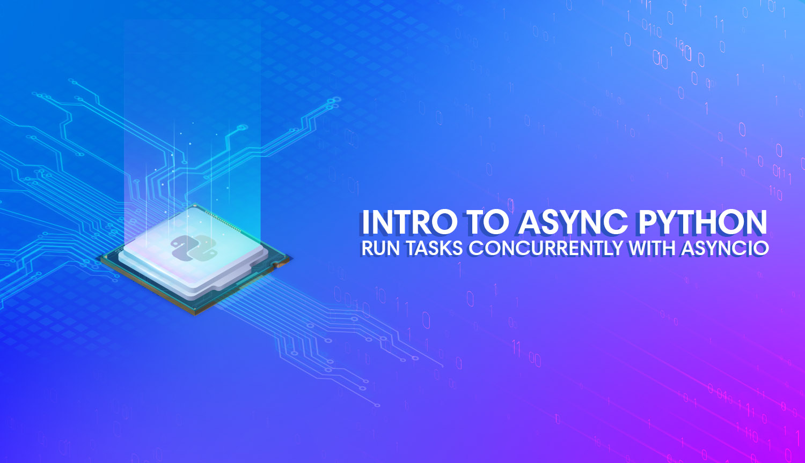

# Intro to Asynchronous Python with Asyncio


[](https://github.com/hackersandslackers/flask-blueprint-tutorial/issues)
[](https://github.com/hackersandslackers/flask-blueprint-tutorial/stargazers)
[](https://github.com/hackersandslackers/flask-blueprint-tutorial/network)



Source code demonstrating asynchronous Python for the Hackersandslackers post: [**Introduction to asynchronous Python with Asyncio**](https://hackersandslackers.com/intro-to-asyncio-concurrency/)

## Getting Started

Get up and running by cloning this repository and running `make deploy`:

```shell
$ git clone https://github.com/hackersandslackers/asyncio-tutorial-part1.git
$ cd asyncio-tutorial-part1
$ make deploy
``` 

-----

**Hackers and Slackers** tutorials are free of charge. If you found this tutorial helpful, a [small donation](https://www.buymeacoffee.com/hackersslackers) would be greatly appreciated to keep us in business. All proceeds go towards coffee, and all coffee goes towards more content.
